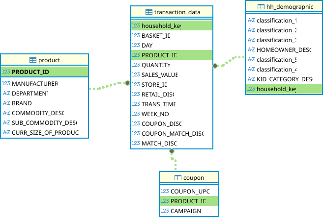
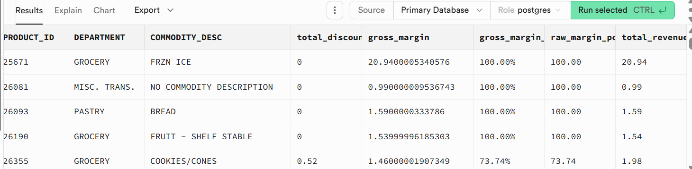
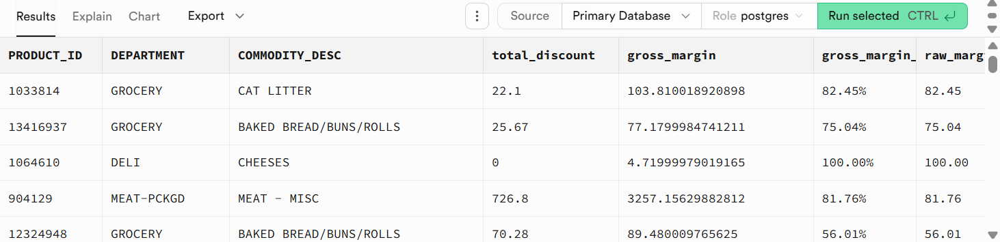
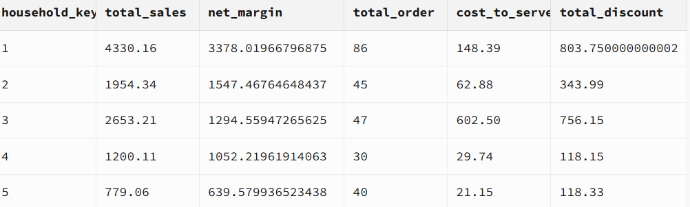
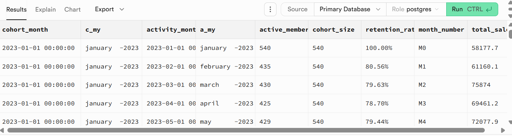

# Advanced-Retail-Analytics-Data-Modeling-with-PostgreSQL-Supabase

## Overview
This project focuses on building production-ready data layer for advanced retail profitability, product mix, cohort analysis and product segmentation using PostgreSQL hosted on Supabase.

Supabase is used as the managed PostgreSQL cloud backend, enabling secure remote access, scalable storage, and seamless integration with external analytics platforms such as Looker Studio, Power BI etc.
>The goal of this project is to create an optimized analytical SQL layer that can easily be consumed by downstream BI tools. [Click here to see]()


## Dataset
#### Source: https://www.dunnhumby.com/source-files

#### Description: This data consist of 8 tables and in this project will be exploring 3 of the tables (Transaction_data, hh_demographic, and product)
>The transaction__data table consists of 13 columns and 2.6 milloin rows, product table consists of 7 columns and 92.4k rows, hh_demographic tbale  consists of  8 fields and 801 rows  

#### File: dunnhumby_the_complete_journey.csv

## Design Philosophy
- **Logic lives in SQL (postgreSQL), not BI tools**

All business logic (joins, calculations, cohort definitions) is handled at the database layer.

- **Views over BI modeling**

Each view represents a trusted metric layer, allowing BI tools to remain lightweight and visualization-focused.

- **Scalable & reproducible**

The database structure is designed to handle larger datasets and evolving analytical requirements.

## Entity Relationship Diagram



The ERD represents the logical structure of the Dunnhumby's The Complete Journey dataset at the base-table level. Analytical complexity is handled through PostgreSQL views rather than physical star-schema modeling, ensuring metric consistency and avoiding double aggregation in BI tools.

## Analytical Views and KPIs Layers

### Product Level Margin 
- This shows the profitability of the products

  
  ```
          CREATE OR REPLACE VIEW dunnhumby.product_margin_view AS
          SELECT 
          P."PRODUCT_ID",
          P."DEPARTMENT",
          P."COMMODITY_DESC",
          ABS(SUM("RETAIL_DISC" + "COUPON_DISC" + "COUPON_MATCH_DISC")) AS total_discount,
          SUM(t."SALES_VALUE") - ABS(SUM("RETAIL_DISC" + "COUPON_DISC" + "COUPON_MATCH_DISC")) AS gross_margin,
          ROUND(
            ((SUM(t."SALES_VALUE") - ABS(SUM("RETAIL_DISC" + "COUPON_DISC" + "COUPON_MATCH_DISC"))) * 100.0/NULLIF(SUM("SALES_VALUE"), 0))::numeric, 2) || '%' AS gross_margin_pct,
          
          ROUND(
            ((SUM(t."SALES_VALUE") - ABS(SUM("RETAIL_DISC" + "COUPON_DISC" + "COUPON_MATCH_DISC"))) * 100.0/NULLIF(SUM("SALES_VALUE"), 0))::numeric, 2) AS raw_margin_pct,
          SUM("SALES_VALUE") AS total_revenue
          FROM dunnhumby.product p
          LEFT JOIN dunnhumby.transaction_view t
          USING("PRODUCT_ID")
          GROUP BY "PRODUCT_ID", "DEPARTMENT", "COMMODITY_DESC"
          ;
  
  ```
  [see full query](advanced_retail_analytics_modeling.SQL)

  

## Product Mix Segmentation

This will help us identify prodcuts driving the most profitable growth and the ones  dragging the overall performance

- Products with high revenue, high margin - stars
- Products with high revenue, low margin - cash cow
- Products with low revenue, high margin - need investigation
- Products with low revenue, low margin - dogs

```
        CREATE OR REPLACE VIEW dunnhumby.product_seg_view AS 
        WITH seg_percentile AS
        (
          SELECT 
            PERCENTILE_CONT(0.5) WITHIN GROUP(ORDER BY raw_margin_pct) AS p_rm_50,
            PERCENTILE_CONT(0.5) WITHIN GROUP(ORDER BY total_revenue) AS p_tr_50
            
          FROM dunnhumby.product_margin_view
        )
        
        SELECT 
        *,
        CASE 
        WHEN raw_margin_pct >= p_rm_50 AND total_revenue >= p_tr_50
        THEN 'Stars' ...

        -- Click the link below to see full query
```
 [see full query](advanced_retail_analytics_modeling.SQL)

  

## Cost to Serve and discount impact
- This view help to see the cost to serve of each household and the impact of the discount on revenue
- It also shows the net margin for each household
  
>deeper analysis will be revealed in BI analysis. [Click here to see]()


```
      -- cost to serve
      CREATE OR REPLACE VIEW dunnhumby.cost_to_serve_view AS 
      SELECT 
      household_key,
      COUNT(DISTINCT "BASKET_ID") * 0.1 AS transaction_cost,
      SUM("QUANTITY") * 0.07 AS fulfiLlment_cost
      FROM dunnhumby.transaction_view 
      GROUP BY household_key;
      
      -- Net margin
      CREATE OR REPLACE VIEW dunnhumby.net_margin_view AS  
      SELECT 
      t.household_key,
      SUM(t."SALES_VALUE") AS total_sales,
      SUM(t."SALES_VALUE") - ABS(SUM(t."RETAIL_DISC" + t."COUPON_DISC" + t."COUPON_MATCH_DISC" )) - (COALESCE(c.transaction_cost,0) + COALESCE(c.fulfillment_cost,0)) AS net_margin,...

      -- click the link below to see full query
```

[see full query](advanced_retail_analytics_modeling.SQL)





## Cohort /retention Analysis

- CTE and window function was employed to calculate the acquisition period of each household, 
- The each cohort's size and decay rate accross the retention periods
- Spending behaviour of older cohorts to the new cohorts
- Revenue contribution of each cohort along the line

  >deeper analysis will be revealed in BI analysis. [Click here to see]()


```
      -- COHORT
      CREATE OR REPLACE VIEW dunnhumby.cohort_view AS
      WITH cohort_count AS 
      (SELECT
      DATE_TRUNC('month', f.first_purchase_date) AS cohort_month,
      TO_CHAR(DATE_TRUNC('month', f.first_purchase_date), 'month-YYYY') AS c_MY,
      DATE_TRUNC('month', t.transaction_date) AS activity_month,
      TO_CHAR(DATE_TRUNC('month', t.transaction_date), 'month-YYYY') AS a_MY,
      COUNT(DISTINCT t.household_key) AS active_members,
      SUM("SALES_VALUE") AS total_sales...
 
      --click the link below to see the full query


```

[see full query](advanced_retail_analytics_modeling.SQL)




## How to reproduce

### Use PostgreSQL(Supabase) or local PostgreSQL

For cloud(Supabas)
- Sign up for a free supabase account
- for Import dunnhumby's the ccomplete journey dataset (transaction_data.csv, hh_demographic.csv, product.csv) using the Supabase Graphics Interface of other methods
  >Note: split large tables such as transaction_data and the hh_demograpics tables and upload them in batches
- Run the [advanced_retail_analytics_modeling.SQL](advanced_retail_analytics_modeling.SQL)

## Performance Optimization & Indexing

I created indexes for improved performance 


```

      CREATE index idx_house_key
      ON dunnhumby.transaction_data(household_key)
      
      CREATE index idx_sales_value
      ON dunnhumby.transaction_data("SALES_VALUE")
      
      create index idx_trans_DAY
      ON dunnhumby.transaction_data("DAY")
      
      create index idx_housekey_day
      ON dunnhumby.transaction_data(household_key, "DAY")

```
[see indexs](complete_journey_indexes.sql)

## Tech Stack I explored in this project

***Database: PostgreSQL***

***Cloud Platform: Supabase (managed PostgreSQL)***

***SQL Features:***

***CTEs***

***Window functions***

***Joins***

***Aggregations***

***Indexing strategies***

***Analytical views***


👤 Akorede Lukman Olamide

>Data Analyst, Data Science & Machine Learning Enthusiast

